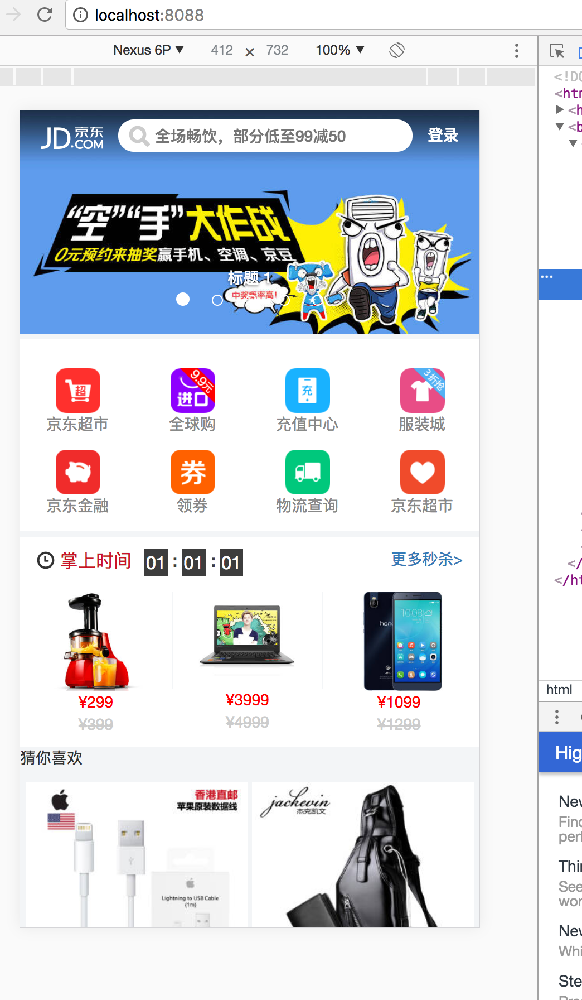

# react-webpack-bootstrap

> 这个是在GitHub上看到的一个模仿京东的页面,自己刚好学习webpack和react不久，想练习一下。
就把别人项目的图片和数据拷贝了一份，然后页面和webpack.config.js根据自己理解从新写了一下，
这里引入了bootstrap，但是只用了一个轮播器和一些字体图标。webpack打包还有很大的优化空间以后
在慢慢修改一下。

> 接下来我可能想写一下dockerfile把这个小demo放到docker中运行，因为看了很多docker的资料
还没有真正实践过。

#### 运行截图

#### webpack 打包
- $ cd app
- $ npm install
- $ npm run start
### 启动node服务
- $ cd server
- $ npm install
- $ npm run start
> 做完以上两个步在浏览器中输入localhost:8088 就可以看到效果
